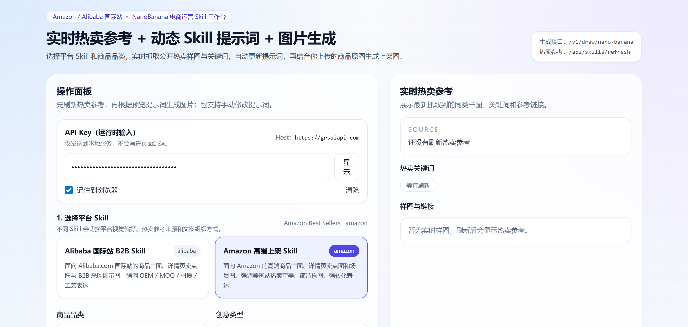
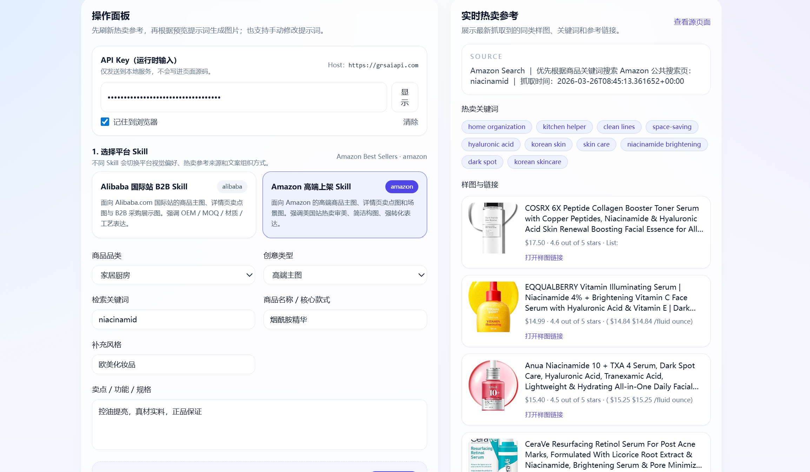
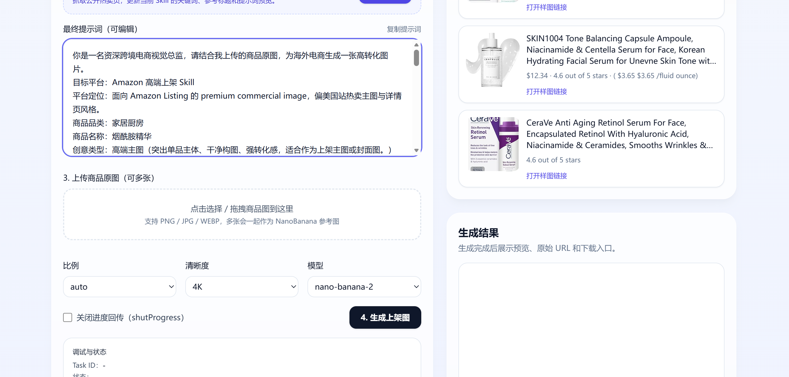
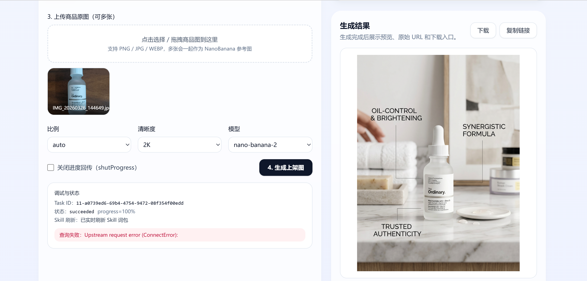

# NanoGen

> 面向跨境电商运营场景的智能商品图生成 WebApp  
> 支持 Amazon / Alibaba International 双平台 Skill，结合实时市场参考、动态提示词和 Nano Banana 图像生成能力，帮助用户更快产出适合上架的高质感商品图。

## 项目亮点

- **关键词优先检索**
  - 不再只依赖泛类目热卖榜，而是优先根据用户输入的商品关键词查找相似商品参考。

- **双平台 Skill**
  - 内置 Amazon 与 Alibaba International 两套电商运营 Skill，可根据平台差异生成不同风格的提示词与展示图。

- **动态 Skill 更新**
  - 点击“更新 Skill”后，后端会实时抓取市场参考、提取关键词，并自动重组当前商品的生成提示词。

- **图生图上架链路**
  - 用户上传商品原图后，可直接结合 Nano Banana 生成更适合电商上架、主图展示或详情页卖点表达的视觉素材。

- **适合多品类**
  - 不局限于美妆个护，像 `robot vacuum`、`toy car`、`charger`、`serum` 等不同类目，都可以通过预输入关键词驱动 Skill 优化。

---

## 项目简介

NanoGen 的目标，是把“商品图上传 → 同款参考检索 → Skill 动态优化 → 电商素材生成”整合成一条可直接使用的本地工作流。

在这个项目里，用户可以：

1. 选择目标平台 Skill
2. 输入商品关键词、商品名称、卖点和风格要求
3. 实时抓取更接近当前商品的市场参考
4. 自动生成适合平台风格的提示词
5. 上传商品原图并生成高端商品展示图

这套流程更贴近真实跨境电商运营，而不是单纯的“输入一句 prompt 出图”。

---

## 效果展示

### 展示一



### 展示二



### 展示三



### 效果图



---

## 核心能力

### 1. Amazon Skill

- 优先使用用户输入的关键词搜索相似商品
- 为避免 Amazon 搜索页不稳定，内置多层回退策略：

```text
Amazon Search
-> DuckDuckGo 索引的 Amazon 商品页
-> Alibaba Showroom 同关键词参考
-> Amazon Best Sellers
```

- 尽量减少直接回退到 `Best Sellers` 的概率，让生成结果更贴近用户当前商品

### 2. Alibaba Skill

- 优先命中关键词对应的 `Showroom`
- 更适合 B2B、OEM、工厂供货、批发风格商品参考
- 可抽取标题、样图、价格区间、MOQ 等公开信息用于提示词优化

### 3. 动态提示词生成

- 根据以下信息自动构造检索上下文与最终提示词：
  - 搜索关键词
  - 商品名称
  - 卖点 / 功能 / 规格
  - 风格说明
  - 当前平台 Skill 规则
  - 创意模式（主图 / 卖点图 / 场景图）

### 4. 图生图链路

- 用户上传商品原图
- 系统生成对应平台风格的提示词
- 再调用 Nano Banana 生成适合上架使用的高端商品图

---

## 适用场景

- Amazon 商品主图优化
- Alibaba International 商品详情图 / 详情首屏图
- 新品上架前的视觉提案
- OEM / ODM 客户提案图
- 多品类商品的快速视觉测试

---

## 项目结构

```text
NanoGen/
├─ README.md
├─ docs/
│  ├─ nanobanana-webapp-配置与启动.md
│  ├─ 展示一.png
│  ├─ 展示二.png
│  ├─ 展示三.png
│  └─ 自搭海外站skill+nano生成效果图.png
└─ webapp/
   ├─ app.py
   ├─ ecommerce_skills.py
   ├─ requirements.txt
   ├─ static/
   │  ├─ index.html
   │  └─ app.js
   ├─ runtime/
   └─ skillpacks/
      ├─ amazon-premium-listing/
      └─ alibaba-premium-listing/
```

---

## 关键代码说明

- `webapp/app.py`
  - FastAPI 服务入口
  - 提供 Skill 列表、Skill 刷新、图片提交与结果查询接口

- `webapp/ecommerce_skills.py`
  - 项目核心逻辑
  - 包含搜索词构造、平台抓取、关键词提取、提示词拼装、缓存与回退策略

- `webapp/static/index.html`
  - 前端页面结构

- `webapp/static/app.js`
  - 前端交互逻辑
  - 负责 Skill 切换、实时刷新、图片上传、任务提交和轮询结果

- `webapp/skillpacks/`
  - 各平台的 Skill 定义
  - 描述平台定位、视觉规则、负面约束和默认策略

---

## 工作流说明

```text
用户输入关键词 / 卖点 / 风格
-> 选择平台 Skill
-> 实时抓取市场参考
-> 提取相似商品关键词与标题
-> 动态生成 Skill 提示词
-> 上传商品原图
-> 调用 Nano Banana 生成最终商品图
```

---

## 快速开始

启动说明请查看：

- `docs/nanobanana-webapp-配置与启动.md:1`

建议按文档完成以下步骤：

1. 创建并激活 conda 环境
2. 安装 `webapp/requirements.txt`
3. 配置 `webapp/config.local.json`
4. 在 `webapp/` 目录启动 FastAPI / uvicorn
5. 打开浏览器开始联调

---

## 当前特性总结

- 已支持 Amazon / Alibaba 双 Skill
- 已支持关键词优先的同款商品检索
- 已支持动态 Skill 刷新
- 已支持 Nano Banana 图像生成链路
- 已支持回退策略与运行缓存

---

## 后续可扩展方向

- 商品标题生成
- 五点描述 / Bullet Points 生成
- A+ 页面文案辅助生成
- 多语言关键词清洗与翻译
- 历史 Prompt / Skill 版本管理
- 更多平台 Skill 扩展

---

## License

当前仓库未附带单独许可证文件，如需开源发布，建议补充 `LICENSE`。
